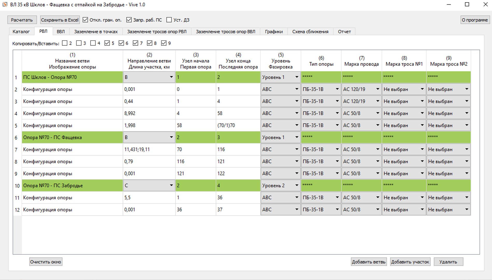
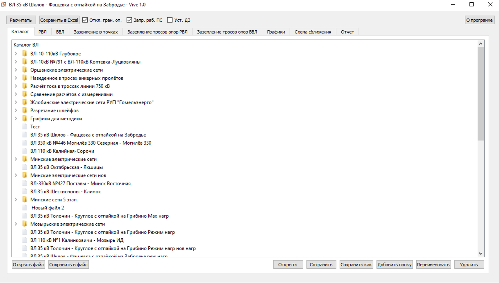
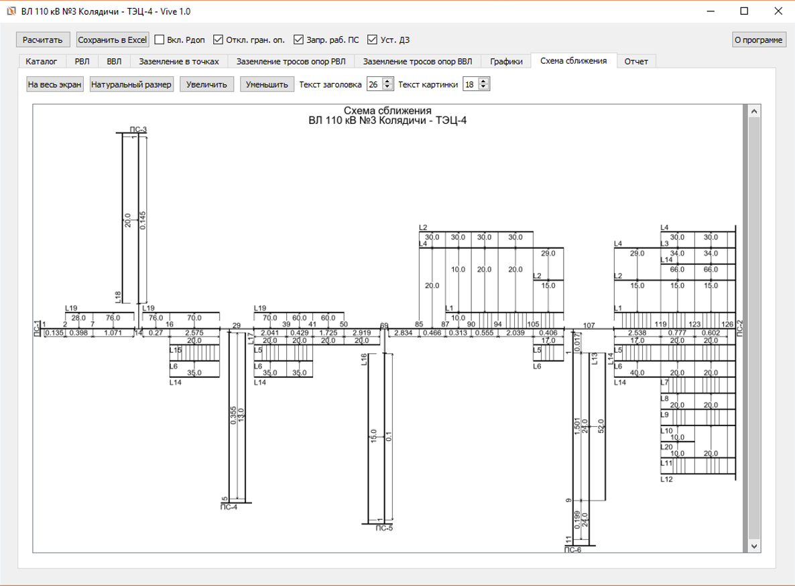
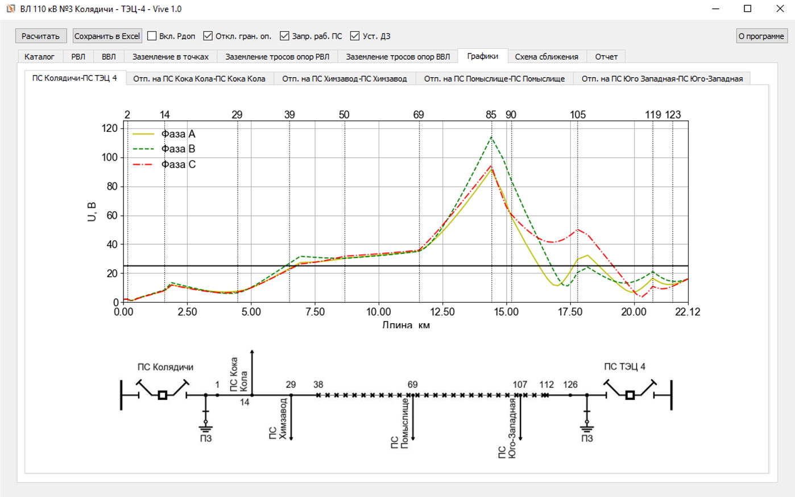
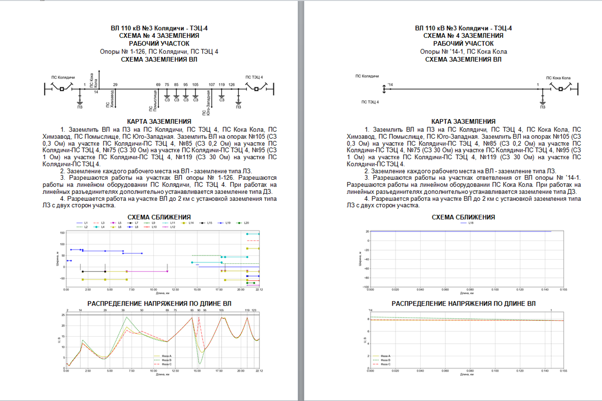

# Vive - calculating of a induct voltage

## Scope of application 
**Vive** - десктопное приложение, предназначенное расчёта наведенного напряжения на воздушных линиях электропередач и автоматической генерацией на основании результатов расчётов отчётной документации формате .docx.

**Vive** - desktop application, designed for calculating induct voltage in overhead transmition lines and automaticaly generation of special documentation in *.docx* format based on resuts of performed calculatings.

## Table of contents

  1. [Description](#Description)
  2. [Used technologies](#Used-technologies)
  3. [Installation](#Installation)
  4. [License](#License)

## Description

UI приложения разработан при помощи кросплатформенного графического фреймворка [PyQt5](https://pypi.org/project/PyQt5/5.9/). Данный фремворк преоставляет богатый функционал для разработки UI, легок в освоении и обладает подробной документацией. 

Application's UI has been designed using a cross-platform UI framework [PyQt5](https://pypi.org/project/PyQt5/5.9/). This framework gives a rich functionality for UI designing, is easy to learn and has detailed documentation.

Ввод исходынх данных в приложения осуществляется путём заполения таблиц *QTableWidget* расположенных во вкладках *QTabWidget*. Для проверки введённых данных на ошибки реализован алгоритм их проверки, который в случае ошибки отобразит модальное окно с типом ошибки и ссылкой на место где она допущена.

Initial data's input into the application is realized by filling in tables *QTableWidget* located into tabs *QTabWidget*. For mistakes finding in entered data  has been realized algorithm that in case of a mistake will show modal window with mistake's type and link to its locating.

Хранение введённых исходных осуществляется в  базе данных *sqlite3*, на основани которой реализованно подобие файловой системы, что обеспечивает удобство хранения данных, групировки и скорость доступа к ним. Помимо этого того реализована возможность сохраниния и открытия исходной информации в виде файлов *.txt*

Storage of entered initial data is realized in database *sqlite3*, on the basis of which has been realized similarity of a file system, that provided convenience of data storage, grouping and  speed of access to it.

Визуализациия введённых исходных данных осуществляется при помощи инструмента работы с изображениями [Pillow](https://pypi.org/project/Pillow/4.2.1/) а так же алгоритма который осуществляет рисование графических приитивов. В результате их работы создаются различные изображения. Данные изображения позволяют легко проверять верность введённых исходных данных, а так же добавлять данные изображения в генерируемые документы.

Visualization of a entered intitial data is realized using library for work with images [Pillow](https://pypi.org/project/Pillow/4.2.1/) and algorithm which realizes drawing grafic primitives. Result of its work is different created images. These images allows easy to check correctness of a entered intitial data and add them into generating documents.

Одной из основных задач данного приложения является расчёт наведенного напряжения, которое реализуется путём составления на основании исходных данных системы линейных алгебраических уравнений и последующее её решение. Подробнее с математической моделью можно ознакомиться в следующих [статьях](https://disk.yandex.by/d/FrIEF12qER-tWQ?w=1). Для решения данной задачи использовались матетические пакеты [Numpy](https://pypi.org/project/numpy/1.15.0/) и [Scipy](https://pypi.org/project/scipy/1.5.4/) которые предоставляют все необходимые для этого инстументы. Так как генерируемые системы уравнений обычно состоят из более 1000 уравнений и более 70 % элементов системы  являются нулевыми были выполенены следующе оптимизации:

One of main tasks of the application is caclculating of a induct voltage, which is realised by way of formation based on initial data system linear algebraic equations and its solve. More details about math model you can find in next [articles](https://disk.yandex.by/d/FrIEF12qER-tWQ?w=1). For solving this task has been used math libraries [Numpy](https://pypi.org/project/numpy/1.15.0/) and [Scipy](https://pypi.org/project/scipy/1.5.4/) which have all needed tools for it. Since generating equation's systems usualy consist from more 1000 equations and 70% of system's elements are null have been done next optimizations:

- Вместо обычных матриц использовались разряженые матрицы *scipy.sparse*. Данный модуль предоставляет все необходимые иструменты для работы с разряженными матрицами а также решатель систем уравнений, основанных на разряженных матрицах. Применение разряженных матриц позволяет сократить затраты памяти на хранение матриц, так как нулевые элементы в них не хранятся, а также сократить время затрачиваемое на решение системы уравнений.
- Instead usual matrixs have been used sparse matrixs *scipy.sparse*. This module has all needed tools for work with sparse matrixs and solver of equation's systems based on sparse matrixs. Using of sparse matrixs allows reduce volume of memory on matrixs' storage  since it does not store null elements, and reduce time of solving equation's systems.
- Кэширование расчитываемых подматриц. Так как матрица системы уравнений формируется путём размещения на ней множества подматриц, которые в свою очередь расчитываются по интегральным выражениям и за частую идентичны друг другу, кэширование данных подматриц по входным параметрам позваляет сократить время затрачиваемое на получение матрицы системы уравнений.
- Caching of calculating submatrixs. Since matrix equation's systems is formed by way putting on it sets submatrixs, which calculating from integral expressions and is often identical to each other, caching these submatrixs by input argument allows reduce spent time on getting of equation's systems matrix.
- Кэширование по исходным данным. Исходные данные можно разделить на различные независимые блоки, на основании которых составляются различные независимые подматрицы системы уравнений. Кэширование данных подмариц  по независимым блокам исходных данных позволяет не делать перерасчёт подматрицы созданных на блоках исходных данных в которых не было изменений. Это позволяет мгновенно получать результаты растётов при отсутвии изменений в исходных данных, а также ускоренный расчёт за счёт отсуствия необходимости пересчитывать все подматрицы. Данные сохраняются между сеансами использования приложения за счёт сохранения полученных подматриц в виде файлов *.npy* и *.npz*, а ссылки на них сеарилизуются из обьекта *dict* в файл при помощи модуля *pickle*.
- Caching by initial data. Initial data can split on different independent blocks, based on which is formed different independent submatrixs of equation's system. Caching these submatrixs by independent blocks of initial data allows not to do recalculation submatrixs created from blocks of initial data which don't have changes. It allows instantly to get calculating's results in case absence of changes or accelerated calculating on account of need's absence to recalculate all submatrixs. Data doesn't lose  between sessions using of application on account of storing  gotten submatrixs in format files *.npy* and *.npz*, and links to its is serialized from *dict* into file by module *pickle*.

Часть данных результатов расчётов представляют собой графики. Для их постоения использовалась библиотека [Matplotlib](https://pypi.org/project/matplotlib/2.2.2/), которая обладает широшим функционалом построения различных и наглядных графиков, а также предоставляет средства для удобного внедерния их UI. Так же данная библиотека позволятет сохранять построенные графики в виде изображений с различными размерами и качеством, необходимо для последующего их внедрения в генерируемые документы.

Чтобы исходные данные были наиболее компактны и не предостваляли лишних неудобств при их введении, они ссылаются на или инные объекты, параметры которых храняться в файле формата *.xlsx*. Файлы данного формата легко редактируется, что в удобно при внесении изменений теми кто не осведомлён об устройстве данного приложения. Для работы с данными файлами использовалсь библиотека [Openpyxl](https://pypi.org/project/openpyxl/2.4.8/), которая позволяет читать и записываь в данные файлы различную информацию. Так же данная билиотека использовалась для предоставления пользователями приложения возможности вывода данных на основании которых строятся графики.

Помимо выполнения расчёта наведенного напряжения важной задачей является автоматичесеская генерация специальной документации в формате *.docx*. Необходимость генерации документов в формате *.docx* обусловлена удобством последующей работы с ними, возможностью редактирования и и объединения их в более сложные документы. Для этого испоьзовалсь библиотека [Python-docx](https://pypi.org/project/python-docx/0.8.6/), которая позваляет составлять данные документы автоматически, вставлять в них изображения, создавать таблицы и так далее. 

## Used technologies

- [Python 3.6.2](https://www.python.org/downloads/) - Python programming language interpreter.
- [Numpy 1.15.0](https://pypi.org/project/numpy/1.15.0/) - general-purpose array-processing package designed to efficiently manipulate large multi-dimensional arrays of arbitrary records without sacrificing too much speed for small multi-dimensional arrays.
- [Scipy 1.5.4](https://pypi.org/project/scipy/1.5.4/) - open-source software for mathematics, science, and engineering.
- [Matplotlib 2.2.2](https://pypi.org/project/matplotlib/2.2.2/) - library for interactive graphing, scientific publishing, user interface development and web application servers targeting multiple user interfaces and hardcopy output formats.
- [PyQt5 5.9](https://pypi.org/project/PyQt5/5.9/) - Python binding of the cross-platform GUI toolkit Qt, implemented as a Python plug-in.
- [Pillow 4.2.1](https://pypi.org/project/Pillow/4.2.1/) - the Python Imaging Library.
- [Openpyxl 2.4.8](https://pypi.org/project/openpyxl/2.4.8/) - Python library to read/write Excel 2010 xlsx/xlsm/xltx/xltm files.
- [Python-docx 0.8.6](https://pypi.org/project/python-docx/0.8.6/) - Python library for creating and updating Microsoft Word (.docx) files.

## Installation 
Для того чтобы использовать данное приложение немобходимо установить компонеты с раздела [Used technologies](#Used-technologies). Первоначально устновите итрепритатор Python, а затем при помощи пакетного менеджера *Pip* установите перечисленные пакеты. При применении версий пакетов отличных от предложенных работоспособность приложения не гарантируется.

## License 
Licensed under the [MIT](LICENSE.txt) license.	

